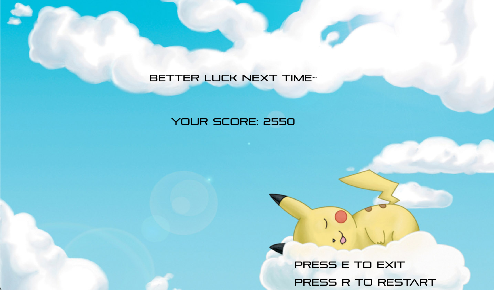

# 2D-shooting-game
NTHU CS. 10710 CS135502 Introduction to Programming (I). Final Project.

2D shooting game developed by Allegro5.

## Installation
Follow the step [here](https://github.com/j3soon/Allegro5Template/blob/master/docs/README.md).

## Game rules
- There are two modes (**normal mode & boss mode**) to play.
- For **normal mode**, kill the floating airplanes to upgrade the level. Once getting level 5, you will enter to the boss mode.
- For **boss mode**, kill the boss to win the game.
- You can also directly enter the boss mode from start scene.

## Game Scene
- Start

- Play

- Boss

- Win

- Lose

